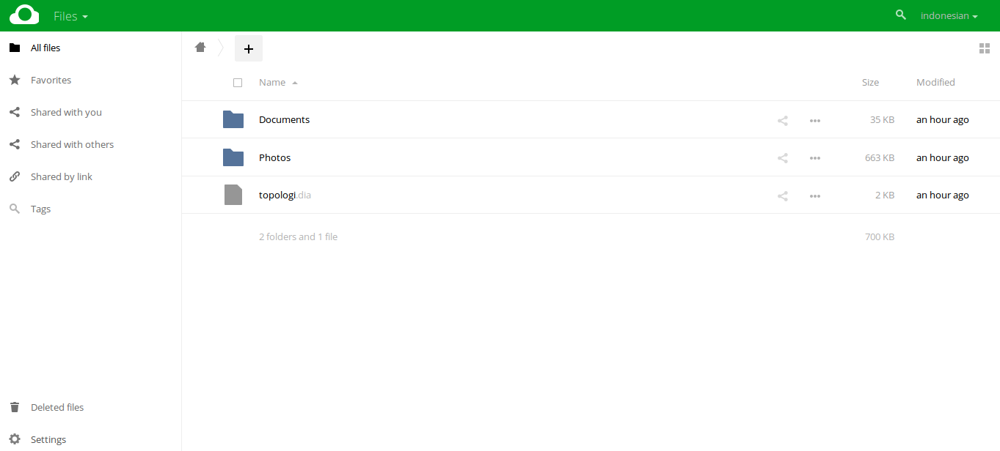

# owncloud-themes
Owncloud Themes Auto With Install

<pre>
root@themes:~# git clone https://github.com/alintamvanz/owncloud-themes.git
root@themes:~# cd owncloud-themes
root@themes:~/owncloud-themes # chmod 755 *
root@themes:~/owncloud-themes # ./install
</pre>

# Screenshot Themes

# BUG? issues?
Submit To Form Issues
